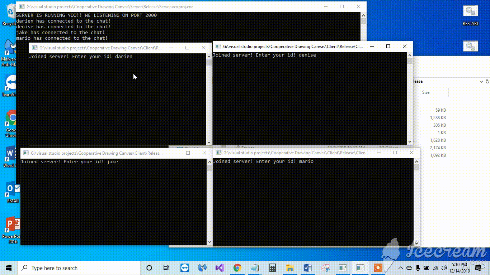

# Complete-chat-messenger
An improvement to my previous chat messenger, where multiple users are able to chat with each other through a server. This is accomplished using TCP sockets and a client-server model. 

SFML and C++ 11 are required to run.

Here's a quick demonstration:

